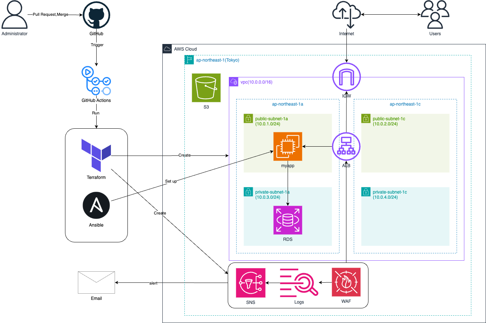

# AWS Course — Terraform × GitHub Actions × Ansible

学習成果として構築した **AWS インフラの IaC／自動化プロジェクト**です。
**Terraform**でインフラをコード化し、**GitHub Actions**でCI/CDを構築、**Ansible**でEC2上のアプリを構成・起動します。

## 1　ハイライト
- **Terraform CI**: PRで `terraform test`→`plan`、`main` への push で `apply`（S3バックエンドを `init -reconfigure`）
- **Ansible CI**: PRで Lint／Syntax Check／Dry-run、本番は `main` push で実行
- **アプリ実行**: Java 21 (Amazon Corretto) を導入し、Spring Boot を **systemd サービス**として起動

---

## 2 インフラ構成図



---

## 3リポジトリ構成
```
terraform/
  environments/
    chapter33/
      backend.tf
      providers.tf
      variables.tf
      main.tf
      test.tftest.hcl
  modules/
    network/     # VPC / Subnets / RT / IGW / NAT など
    ec2/         # SG / EC2 / EIP
    alb/         # ALB / TG / Listener
    rds/         # RDS (MySQL)
    monitoring/  # SNS / CloudWatch Alarms
    waf/         # WAFv2 + Logs + Alarms
Ansible/
  install_java.yaml
  deploy_myapp.yaml
  inventory.ini
.github/workflows/
  Ansible.yaml
  Terraform-CI.yaml
  github-actions-demo.yml
```

---

## 4 Terraform — インフラ構成

### network モジュール
- **役割**: VPC、パブリック/プライベートサブネット、ルートテーブル、IGW、NAT など
- **出力例**: `vpc_id`, `public_subnet1a_id`, `private_subnet1a_id`

### ec2 モジュール
- **役割**: アプリ用 EC2、SG、EIP
- **入力**: `key_name`, `ssh_location`, `public_subnet_ids`
- **出力**: `instance_main_id`, `ec2_sg`

### alb モジュール
- **役割**: ALB、Target Group、Listener
- **入力**: `instance_main_id`, `subnet_ids`
- **出力**: `alb_main_arn`

### rds モジュール
- **役割**: MySQL 8.0 / gp2、DB Subnet Group、RDS SG（EC2 SGからアクセス許可）
- **入力**: `DBusername`, `DBpassword`, `private_subnet_list`

### monitoring モジュール
- **役割**: SNSトピック＋メール購読、EC2 CPU高騰アラーム
- **入力**: `alert_email`, `instance_main_id`
- **出力**: `sns_topic_arn`

### waf モジュール
- **役割**: WAFv2 ACL、ALB にアタッチ、CloudWatch Logs＋SNS通知
- **入力**: `alb_arn`, `sns_topic_arn`

> **モジュール間の依存**
> - `network` → `ec2` / `alb` / `rds`
> - `ec2.instance_main_id` → `alb` / `monitoring`
> - `alb.alb_main_arn` → `waf`
> - `monitoring.sns_topic_arn` → `waf`

---

## 5　CI/CD (GitHub Actions)

### Terraform CI（`.github/workflows/Terraform-CI.yaml`）
- **PR**: `terraform test` → `terraform plan`
- **main push**: `terraform apply -auto-approve`
- **Secrets**:
  - `AWS_ACCESS_KEY_ID`, `AWS_SECRET_ACCESS_KEY`, `AWS_DEFAULT_REGION=ap-northeast-1`
  - `TEST_TFVARS`（変数定義をファイル化して投入）

### Ansible CI（`.github/workflows/Ansible.yaml`）
- **PR**: ansible-lint / Syntax Check / Dry-run（`--check`）
- **main push**: `install_java.yaml` → `deploy_myapp.yaml` を本番実行
- **Secrets**:
  - `EC2_PRIVATE_KEY`（SSH接続用の秘密鍵）

---

## 6 Ansible（サーバ構成）

### install_java.yaml
- **内容**: Amazon Corretto 21 を `dnf` で導入

### deploy_myapp.yaml
- `/app` を作成
- `myapp.jar` と `myapp-plain.jar` を配置
- `myapp.service` を `/etc/systemd/system/` に生成
- systemd で再起動＆有効化

### 実行方法（ローカル例）
```bash
ansible-playbook -i Ansible/inventory.ini Ansible/install_java.yaml
ansible-playbook -i Ansible/inventory.ini Ansible/deploy_myapp.yaml
```

---

## 7 動作確認（Verification）
- `systemctl status myapp` / `journalctl -u myapp` で起動とログを確認
- `http://<EC2 IP>:8080/test` にアクセスして Spring Boot が応答

---

## 8 設計のポイント
- **IaC の再現性**: modules に分割し、環境ディレクトリで組み合わせ
- **安全なCI**: PR で必ずテスト/計画、本番反映は `main` のみ
- **運用性**: systemd による常駐、CloudWatch + SNS による監視、WAF ログ/アラーム通知

---

## 9 使い方（最短手順）
1. **Secrets を設定**
   - `AWS_ACCESS_KEY_ID`, `AWS_SECRET_ACCESS_KEY`, `AWS_DEFAULT_REGION`, `TEST_TFVARS`, `EC2_PRIVATE_KEY`
2. **PR を作成** → CI が自動でテスト・Plan・Lint を実施
3. **main へマージ/Push** → Terraform Apply → Ansible 実行で構築＆配備

---
